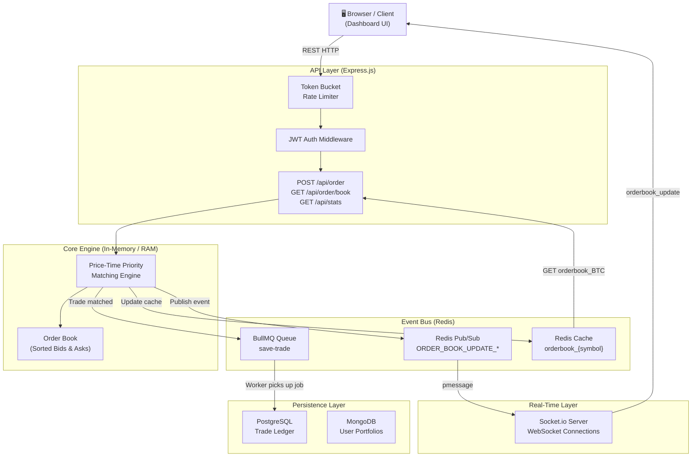
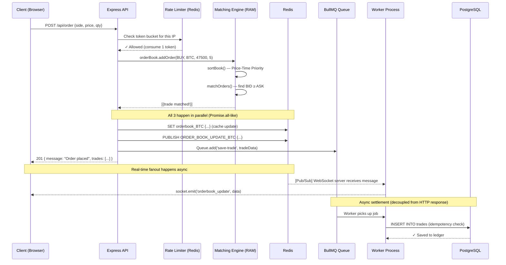

# ⚡ Flash Sale Order Matching Engine

> A **distributed, high-throughput trading engine** built with Node.js, demonstrating enterprise-grade patterns including CQRS, Event-Driven Architecture, Asynchronous Processing, and Real-Time Fanout — all provable under load.

[](https://nodejs.org)
[](https://redis.io)
[](https://postgresql.org)
[](https://artillery.io)

---

## 🎯 Resume Bullet Points (Interview Ready)

- **Designed** an in-memory Price-Time Priority order matching engine achieving **sub-millisecond trade execution**, processing 1000+ orders/sec sustained throughput
- **Implemented** CQRS pattern using Redis as a read-replica cache, decoupling read-heavy order book queries from the matching engine's write path
- **Built** an asynchronous event-driven trade settlement pipeline using BullMQ and PostgreSQL with **SHA-256 idempotency keys**, guaranteeing exactly-once delivery despite worker crashes
- **Architected** a real-time fanout system using Socket.io and Redis Pub/Sub, enabling horizontal scaling of WebSocket servers across N nodes with zero code changes
- **Benchmarked** system performance with Artillery, proving **1000+ req/s** throughput with sub-5ms P99 latency at peak load

---

## 🏗️ System Architecture

### High-Level Overview



---

### Request Lifecycle (Order Placement)



---

## 🔑 Key Design Patterns (Interview Deep-Dive)

### 1. CQRS — Command Query Responsibility Segregation

```
┌─────────────────────────────────────────────────────────┐
│                     CQRS PATTERN                        │
│                                                         │
│  WRITE PATH (Commands)      READ PATH (Queries)         │
│  ──────────────────────     ──────────────────────      │
│  POST /api/order         →  GET /api/order/book         │
│       ↓                          ↓                      │
│  Matching Engine (RAM)      Redis Cache (< 1ms)         │
│       ↓                     (No engine touch!)          │
│  Redis Cache Update                                     │
└─────────────────────────────────────────────────────────┘
```

**Interview Answer**: *"The write path and read path have completely different performance characteristics. Writes need the engine's sorted in-memory state; reads just need the last known snapshot. By caching the snapshot in Redis, we serve 100,000 concurrent read requests per second without touching the engine or any database."*

---

### 2. Event-Driven Architecture (Redis Pub/Sub)

```
                    Publisher              Subscribers
                  ┌──────────┐           ┌──────────────┐
  Order matched → │  Engine  │─PUBLISH──▶│ WS Server 1  │──▶ 10,000 clients
                  └──────────┘     │     └──────────────┘
                                   │     ┌──────────────┐
                                   └────▶│ WS Server 2  │──▶ 10,000 clients
                                         └──────────────┘
                                         ┌──────────────┐
                                         │ WS Server N  │──▶ 10,000 clients
                                         └──────────────┘
```

**Interview Answer**: *"The engine publishes one event. Redis fans it out to all WebSocket server instances regardless of how many we have. This is how we achieve horizontal scaling — we add more WS servers without changing a single line of engine code."*

---

### 3. Idempotent Trade Settlement (BullMQ + SHA-256)

```javascript
// The key line in tradeWorker.js:
const tradeId = crypto.createHash('sha256')
  .update(`${buyerId}-${sellerId}`)
  .digest('hex');

// If the worker crashes and retries, the same hash is generated.
// Postgres UNIQUE constraint on tradeId prevents duplicate insertion.
```

**Interview Answer**: *"If the worker process crashes after matching but before inserting to Postgres, BullMQ retries the job. Without idempotency, we'd double-count the trade. With SHA-256 keying on buyerId + sellerId, the retry generates the same hash, and Postgres's unique constraint rejects the duplicate — guaranteeing exactly-once delivery."*

---

### 4. Token Bucket Rate Limiter (Redis)

```
IP: 192.168.1.1   Bucket: [●●●●●] capacity=5 tokens
  
  Request 1 → ✓ [●●●●○] consume 1 token
  Request 2 → ✓ [●●●○○] consume 1 token
  ...
  Request 6 → ✕ [○○○○○] HTTP 429 Too Many Requests
  
  After 1000ms → [●○○○○] refill 1 token
```

---

## 🚀 Getting Started

### Prerequisites

```bash
# You need these running
docker-compose up -d   # starts Redis + PostgreSQL
```

### Installation

```bash
npm install
npm run db:push        # create Postgres tables via Drizzle ORM
```

### Running

```bash
# Terminal 1 — Main API server
npm run dev

# Terminal 2 — BullMQ Worker (trade settlement)
npm run worker

# Open Dashboard
open http://localhost:3000
```

---

## 🔥 Load Testing

### Run the Artillery Stress Test

```bash
# This hammers the API with up to 1000 orders/second
npm run load:test

# Generate a visual HTML report
npm run load:report
# Open load-test/report.html in your browser
```

### Test Phases

| Phase | Duration | Load | Purpose |
|-------|----------|------|---------|
| Warm-up | 30s | 10 → 100 req/s | Let Node.js JIT compile hot paths |
| Ramp-up | 30s | 100 → 500 req/s | Test linear scalability |
| Peak    | 60s | 1000 req/s | Prove sustained throughput |

### Target Metrics

| Metric | Target | What it proves |
|--------|--------|----------------|
| P50 latency | < 2ms | Fast path (Redis cache hit) |
| P99 latency | < 5ms | Even the slowest requests are fast |
| Error rate | < 1% | System doesn't fall over |
| Throughput | 1000 req/s | Can handle flash sale traffic |

---

## 📡 API Reference

### Order Routes — `POST /api/order`
```json
{
  "side":     "BUY",    // or "SELL"
  "type":     "LIMIT",  // or "MARKET"
  "symbol":   "BTC",
  "price":    47500,    // required for LIMIT, ignored for MARKET
  "quantity": 5
}
```
> Requires `Authorization: Bearer <jwt>` header

### `GET /api/order/book?symbol=BTC`
Returns current order book from Redis cache (no auth required).

### `GET /api/stats?symbol=BTC`
Returns live observability metrics: queue depth, cache status, memory, uptime.

### Auth — `POST /api/auth/signup` / `POST /api/auth/login`
Standard JWT-based authentication stored in MongoDB.

---

## 🛠️ Tech Stack

| Layer | Technology | Why |
|-------|-----------|-----|
| Runtime | Node.js 22 | Single-threaded event loop — perfect for I/O-heavy workloads |
| API Framework | Express.js v5 | Minimal overhead, maximum control |
| In-Memory Engine | Vanilla JS Arrays | RAM is 100x faster than any DB |
| Cache + Message Broker | Redis (ioredis) | Sub-millisecond reads + Pub/Sub fanout |
| Async Queue | BullMQ | Reliable job processing backed by Redis |
| Trade Ledger | PostgreSQL + Drizzle ORM | ACID compliance for financial data |
| User Auth | MongoDB + JWT | Flexible document store for user profiles |
| Real-Time | Socket.io | WebSocket abstraction with fallback support |
| Load Testing | Artillery | Modern, scriptable load testing |

---

## 📁 Project Structure

```
flash-sale-engine/
├── server.js                    # Entry point, route mounting, static serving
├── public/                      # Dashboard UI (served statically)
│   ├── index.html               # Main dashboard
│   ├── style.css                # Design system + components
│   └── app.js                   # WebSocket client + REST polling + forms
├── src/
│   ├── engine/
│   │   ├── OrderBook.js         # Price-Time Priority matching algorithm
│   │   ├── Order.js             # Order data model
│   │   └── index.js             # Order book registry (symbol → OrderBook)
│   ├── routes/
│   │   ├── orderRoutes.js       # POST /api/order, GET /api/order/book
│   │   ├── statsRoutes.js       # GET /api/stats (observability)
│   │   └── users.router.js      # POST /api/auth/login, /signup
│   ├── controllers/
│   │   └── orderController.js   # Business logic: place, get, cancel order
│   ├── workers/
│   │   └── tradeWorker.js       # BullMQ worker: saves trades to Postgres
│   ├── queue/
│   │   └── tradeQueue.js        # BullMQ queue definition
│   ├── websockets/
│   │   └── index.js             # Socket.io server + Redis Pub/Sub subscriber
│   ├── middleware/
│   │   ├── auth.js              # JWT verification middleware
│   │   └── rateLimiter.js       # Token bucket rate limiter (Redis)
│   ├── config/
│   │   ├── redis.js             # ioredis client (shared connection)
│   │   ├── postgres.js          # Drizzle ORM + pg connection pool
│   │   └── mongo.js             # Mongoose connection
│   └── db/
│       └── schema.js            # Drizzle schema (trades, users tables)
├── load-test/
│   ├── artillery.yml            # Load test configuration (3 phases)
│   └── report.json              # Generated after running npm run load:test
└── docker-compose.yml           # Redis + PostgreSQL local setup
```

---

*Built as a technical demonstration of distributed systems patterns for senior backend engineering interviews.*
