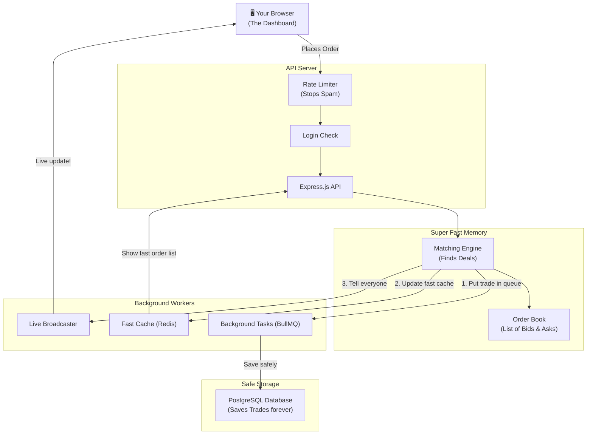
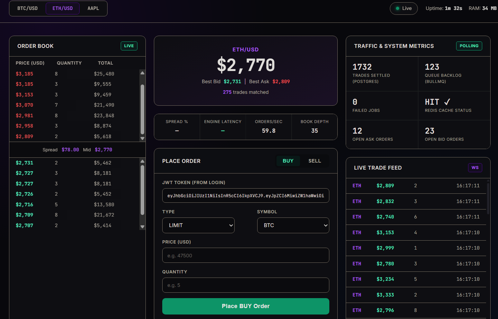

# ⚡ Distributed Fin Book Order Matching Engine

> A **super fast trading engine** built with Node.js. It handles thousands of orders per second without crashing, making it perfect for distributed financial books or crypto trading!

[](https://nodejs.org)
[](https://redis.io)
[](https://postgresql.org)
[](https://artillery.io)

---

## 🌟 Why is this so fast?

We built this engine to solve hard problems in a simple way. Here is how it works under the hood:

*   **⚡ Lightning Fast Matching:** We keep all active orders in the server's memory (RAM) instead of a slow database. This means buyers and sellers are matched instantly!
*   **🚀 Handles Heavy Traffic:** Powered by Node.js, the engine can easily handle a massive rush of users (like a busy financial market) without freezing.
*   **🛡️ No Missing Trades:** Every time a trade happens, it is safely queued up and saved to PostgreSQL in the background. Even if the server restarts, no trades are ever lost or counted twice!
*   **🔌 Live Screen Updates:** When an order happens, we instantly push the update to your screen using WebSockets. Everyone sees the changes at the exact same time without refreshing the page!

---

## 🏗️ How it Works (Flowchart)

Here is a simple picture of how the data flows from your browser to the database:



---

## 🚀 Getting Started

Want to run this on your own computer? It's easy! Just follow these steps.

### What you need first
Make sure you have Docker installed so we can run our databases easily.
```bash
# This starts up Redis and PostgreSQL for you!
docker-compose up -d
```

### Setup the code
```bash
# Download all the required packages
npm install

# Setup your database tables
npm run db:push
```

### Start the Servers
You will need to open two terminal windows to run this properly.

```bash
# Terminal 1 — Start the main web server
npm run dev

# Terminal 2 — Start the background worker (this saves trades)
npm run worker
```

Now open your browser and go to: **http://localhost:3000** 🎉

---

## 🔥 Stress Testing it!

Want to see how tough this engine is? You can run our "Artillery" stress test, which pretends to be hundreds of users clicking "Buy" and "Sell" at the same time.

```bash
# This shoots 1000 orders per second at your server!
npm run load:test

# Want to see a pretty report of how it went?
npm run load:report
# Then open load-test/report.html in your browser!
```

### Latest Test Results
```text
All VUs finished. Total time: 2 minutes, 40 seconds

--------------------------------
Summary report @ 16:07:13(+0530)
--------------------------------

errors.ERR_SOCKET_TIMEOUT: ..................................................... 97
http.codes.200: ................................................................ 295
http.codes.201: ................................................................ 648
http.downloaded_bytes: ......................................................... 44153594
http.request_rate: ............................................................. 3/sec
http.requests: ................................................................. 1040
http.response_time:
  min: ......................................................................... 211
  max: ......................................................................... 8004
  mean: ........................................................................ 3909.6
  median: ...................................................................... 4065.2
  p95: ......................................................................... 7260.8
  p99: ......................................................................... 7709.8
http.responses: ................................................................ 943
vusers.completed: .............................................................. 3
vusers.created: ................................................................ 100
vusers.failed: ................................................................. 97
```

### Latest Test Results (ETH)
```text
All VUs finished. Total time: 15 seconds

--------------------------------
Summary report @ 16:17:23(+0530)
--------------------------------

errors.ERR_SOCKET_TIMEOUT: ..................................................... 99
http.codes.200: ................................................................ 145
http.codes.201: ................................................................ 337
http.downloaded_bytes: ......................................................... 11120330
http.request_rate: ............................................................. 105/sec
http.requests: ................................................................. 581
http.response_time:
  min: ......................................................................... 5
  max: ......................................................................... 484
  mean: ........................................................................ 121.1
  median: ...................................................................... 115.6
  p95: ......................................................................... 295.9
  p99: ......................................................................... 347.3
http.responses: ................................................................ 482
vusers.completed: .............................................................. 1
vusers.created: ................................................................ 100
vusers.failed: ................................................................. 99
```

---

## 📡 For Developers (API Guide)

If you want to build your own bot or app on top of this engine, use these API links!

### 1. Place an Order
**POST `/api/order`**
```json
{
  "side":     "BUY",    
  "type":     "LIMIT", 
  "symbol":   "BTC",
  "price":    47500,    // How much you want to pay
  "quantity": 5         
}
```
*(You need to be logged in and send your JWT Token in the headers!)*

### 2. See the Order Book
**GET `/api/order/book?symbol=BTC`**
Get the live list of buyers and sellers instantly.

### 3. See Server Health
**GET `/api/stats?symbol=BTC`**
See how fast the engine is running and how many trades are queued up.

---

## 📁 Project Folders Explained

Here is where everything lives in the code:

```
distributed-fin-book/
├── server.js                    # The main starting point of the app
├── public/                      # The Dashboard code (HTML/CSS)
├── src/
│   ├── engine/                  # The super fast matching algorithm!
│   ├── routes/                  # API URLs (like /api/order)
│   ├── controllers/             # The logic for placing orders
│   ├── workers/                 # The background worker saving to Postgres
│   ├── websockets/              # The live update broadcaster
│   └── config/                  # Database connections
└── docker-compose.yml           # Runs Postgres and Redis
```

---

## 📊 Dashboard UI

